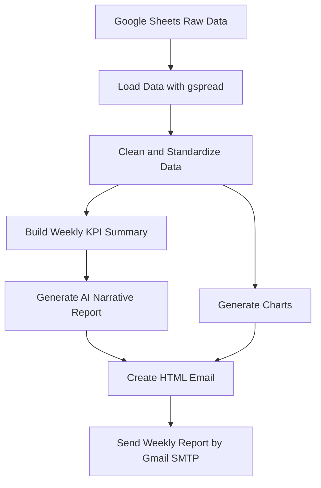
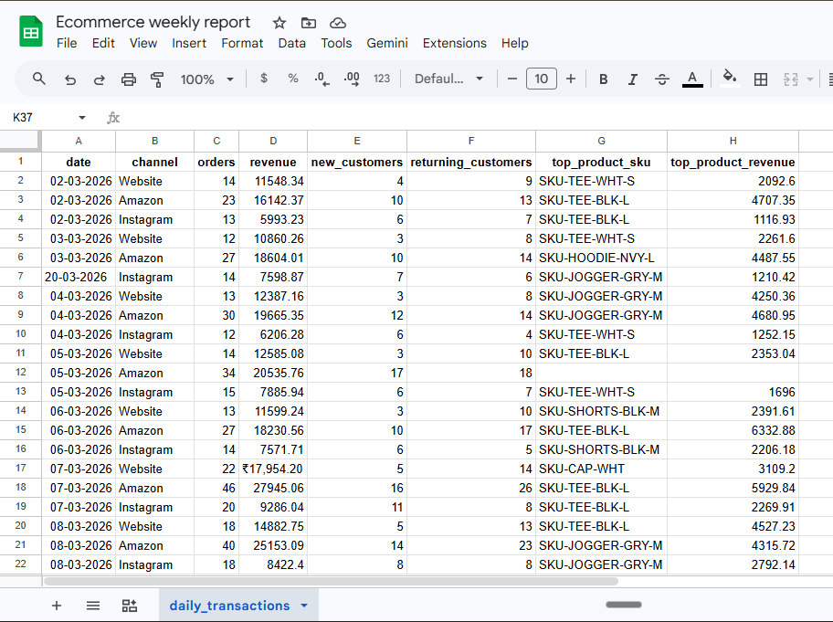
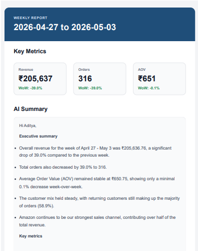
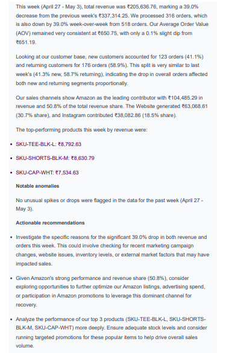
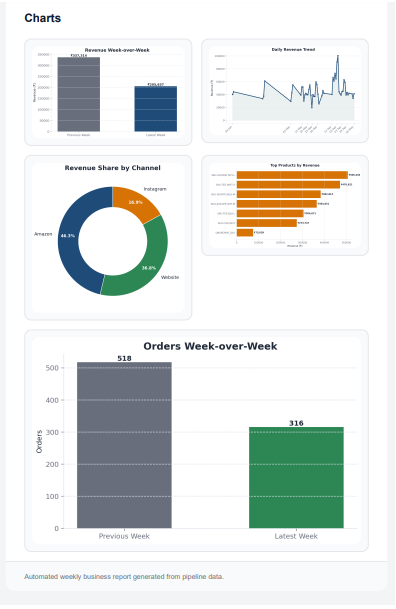

# AI Weekly Business Report Automation

Automated Python pipeline that pulls business data from Google Sheets, cleans it, computes weekly KPIs, generates an AI-written report, creates charts, and emails a polished HTML report to stakeholders.

This project is designed as a portfolio-quality example of how to combine data analytics, LLMs, charting, and workflow automation in one realistic business use case.

---

## 1. Problem this solves

Most small and mid-size businesses do not have a clean weekly reporting system.

Typical problems:

- Data sits in Google Sheets but is messy and inconsistent.
- Revenue, orders, customer mix, and product performance are not reviewed properly every week.
- Reports are often created manually, which is slow and error-prone.
- Owners or stakeholders do not receive a clear business summary on time.

This project turns that process into one structured weekly reporting workflow.

---

## 2. What this project does

At a high level, the pipeline does:

1. **Fetch data from Google Sheets**  
   Reads daily business data such as date, channel, orders, revenue, customer counts, and top product information.

2. **Clean and validate the data**  
   - Parses dates flexibly  
   - Standardizes channel names  
   - Cleans numeric columns  
   - Removes duplicates  
   - Handles missing values safely  
   - Keeps the cleaned dataframe usable in memory even if optional CSV export fails

3. **Compute weekly KPIs**  
   - Latest completed week vs previous week  
   - Total revenue and total orders  
   - Average order value  
   - New vs returning customer split  
   - Channel contribution  
   - Top products  
   - Summary metrics used for reporting

4. **Generate an AI-written weekly report**  
   Sends the weekly summary to Gemini and returns a business-style narrative report with:
   - Executive summary
   - Key insights
   - Practical recommendations

5. **Generate charts automatically**  
   Creates dynamic charts from the cleaned weekly data, including:
   - Revenue week-over-week
   - Orders week-over-week
   - Daily revenue trend
   - Channel mix
   - Top products by revenue

6. **Send a styled HTML email**  
   Builds an HTML email with:
   - Clean structure
   - KPI highlights
   - AI-written summary
   - Inline chart images
   - Plain text fallback for compatibility

All of this runs from a single orchestration script, so one command can generate and send the full weekly report.

---

## 3. Architecture (high-level workflow)

### Text version

```text
Google Sheets (raw business data)
        ↓
Python: cleaning.py         # clean and standardize data
        ↓
Python: metrics.py          # compute weekly KPIs and summary
        ↓
Python: llm_client.py       # generate AI-written weekly report
        ↓
Python: charts.py           # generate visual charts
        ↓
Python: email_client.py     # build HTML email and send via Gmail SMTP
        ↓
Final stakeholder email
```

### Mermaid workflow diagram



---

## 4. Tech stack

**Core tools used:**

- Python
- Pandas
- Google Sheets API / gspread
- Matplotlib
- Gmail SMTP
- HTML email formatting
- Google Gemini API

**Where it runs:**

- Local machine by default
- Can be run manually or scheduled later with Windows Task Scheduler

---

## 5. Project structure

```text
ai-weekly-business-report-automation/
│
├── run_weekly_report.py      # Main orchestration script
├── cleaning.py               # Data cleaning and validation
├── metrics.py                # Weekly KPI summary generation
├── llm_client.py             # Gemini-based report generation
├── charts.py                 # Chart creation
├── email_client.py           # HTML email generation and sending
├── run_pipeline.bat          # Optional local batch runner
├── README.md
│
├── charts/                   # Generated chart images
├── images/                   # README screenshots
├── data/                     # Optional local debug/output files
│
├── config_local.py           # Local secrets only, not uploaded
└── .gitignore
```

---

## 6. How the pipeline works

1. **Load raw data from Google Sheets**  
   `run_weekly_report.py` reads business data from a configured Google Sheet using a service account.

2. **Clean and normalize the data**  
   `cleaning.py`:
   - checks required columns
   - parses dates
   - standardizes channels
   - cleans numeric values
   - removes duplicates
   - safely handles missing values

3. **Build weekly summary**  
   `metrics.py`:
   - identifies the latest completed week
   - compares it with the previous week
   - computes revenue, orders, AOV, and customer mix
   - prepares the summary dictionary used by the LLM and charts

4. **Generate AI report**  
   `llm_client.py` sends the summary into Gemini and gets back a structured weekly business report in plain English.

5. **Generate charts**  
   `charts.py` creates dashboard-style PNG charts dynamically from the cleaned dataframe and summary.

6. **Send HTML email**  
   `email_client.py` builds the email body, embeds charts as inline images using CID references, and sends the report through Gmail SMTP.

7. **Run everything in one go**  
   `run_weekly_report.py` orchestrates the full pipeline from input to final email.

---

## 7. How to run it locally

> Important: Keep all secrets local. Do not upload API keys, Gmail app passwords, service account JSON files, or local config files to GitHub.

1. **Clone the repository**

```bash
git clone https://github.com/your-username/ai-weekly-business-report-automation.git
cd ai-weekly-business-report-automation
```

2. **Create and activate a virtual environment (optional but recommended)**

```bash
python -m venv venv
venv\Scripts\activate
```

3. **Install dependencies**

```bash
pip install -r requirements.txt
```

4. **Create local config**

Create a `config_local.py` file for:
- Gemini API key
- Gmail sender email
- Gmail app password
- recipient email
- service account file path
- Google Sheet ID
- worksheet name

5. **Run the pipeline**

```bash
python run_weekly_report.py
```

If everything is configured correctly, the script will generate the summary, create charts, build the email, and send the weekly report.

---

## 8. Screenshots

### Google Sheet data source



### Email dashboard screenshot 1



### Email dashboard screenshot 2



### Email dashboard screenshot 3



---

## 9. Business value

This project shows how raw operational data can be turned into a stakeholder-ready weekly business report automatically.

Instead of manually checking spreadsheets, writing updates, and preparing visuals, the entire reporting flow is handled through one pipeline. This makes reporting faster, cleaner, and more scalable for small business and e-commerce use cases.

---

## 10. Security notes

The repository should exclude all local-only and sensitive files using `.gitignore`, including:

- `config_local.py`
- service account JSON files
- `.env` files
- virtual environments
- logs
- cache files

No credentials or secrets should be committed to GitHub.

---

## 11. project summary

**AI-Powered Weekly Business Report Automation Pipeline**

Built an end-to-end Python reporting pipeline that pulls business data from Google Sheets, cleans and analyzes it, generates an AI-written weekly summary, creates charts, and sends a styled HTML email report to stakeholders automatically.

---

## 12. Future improvements

- Add stronger anomaly detection
- Support multiple businesses or clients
- Add database storage for long-term tracking
- Improve email templates further
- Add cloud scheduling for fully remote automation
